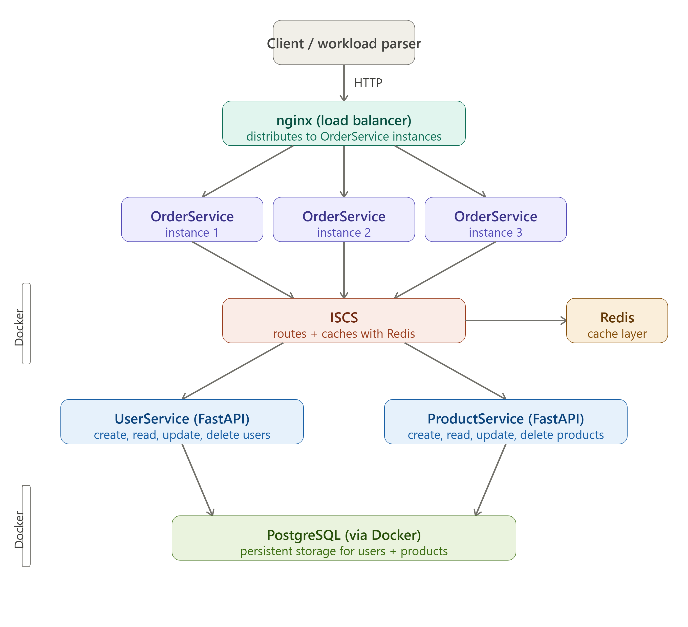

# Exceptional University Projects 🎓💻

This repository is a curated collection of **notable software projects, labs, and assignments** completed during my time at the **University of Toronto Mississauga**. It highlights my work across **Java, Python, RISC-V Assembly, object-oriented design, software architecture, data structures, algorithms, and interactive media**.

Rather than serving as a single application, this repo acts as a **portfolio of academic and technical growth**, showcasing both small foundational exercises and larger, system-level projects.

---

## 📂 Repository Overview

The repository is organized into several major projects and collections:

- **Boggle Game** — Full Java implementation of the Boggle word game  
- **Computer Science Labs & Assignments** — Java, Python, and RISC-V Assembly labs covering OOP, design patterns, algorithms, data structures, and computer architecture  
- **Shadow In The Dark** — Full-featured survival game written entirely in RISC-V assembly  
- **Inventory Server** — Distributed microservice-style backend system  
- **Map Plotting & Search** — Python-based data visualization and filtering system  
- **The Twine Interview** — Interactive narrative game exploring bias and decision-making

Each section below links directly to its folder and explains its technical focus.

---

## 🎲 Boggle Game (Java)

📁 `Boggle Game/`

A complete **Java-based implementation of the Boggle word game**, including game logic, scoring, persistence, and testing.

### Key Features

- Object-oriented design with clear separation of concerns
- Dictionary-based word validation
- Persistent storage for saved games and scores
- Unit tests to verify correctness
- Modular architecture (game logic, grid, stats, storage)

### Technologies & Concepts

- Java
- OOP principles
- File I/O
- Unit testing
- Data persistence

### Screenshot

---

## 🧪 Computer Science Labs & Assignments

📁 `CS Labs/`

A comprehensive collection of labs across **three core computer science courses**, covering programming fundamentals, data structures, algorithms, and computer architecture.

---

### 📁 CSC148 - Python

Python labs covering core computer science concepts and data structures.

#### Topics Covered

- Object-Oriented Programming
- Abstract Data Types
- Recursion & Iteration
- Trees, BSTs, Linked Lists
- Sorting algorithms (TimSort)
- Testing & test-driven development

#### Notable Highlights

- **Tree & BST Implementation** (Lab08, Lab09)
- **Recursive List Structures** (Lab06, Lab07)
- **Performance Profiling** (Lab09)
- **TimSort Implementation** (Lab11)

---

### 📁 CSC207 - Java

Java labs emphasizing object-oriented design and software design patterns.

#### Topics Covered

- Object-Oriented Programming (Java)
- Design Patterns:
  - Adapter Pattern
  - Decorator Pattern
  - Observer Pattern
  - Visitor Pattern
- Testing & test-driven development
- Event-driven programming

#### Notable Highlights

- **AST Expression Evaluator** (Lab07) — Visitor pattern implementation
- **Tree Visualization & Filtering** (Lab05) — Event handling and data visualization
- **Braille Translator** (Lab04) — Character encoding and translation
- **Design Pattern Implementations** (Lab06, Lab08, Lab09, Lab10)

---

### 📁 CSC258 - Assembly (RISC-V)

RISC-V assembly projects demonstrating low-level programming, processor behavior, memory systems, pipelining, and performance optimization.

All programs were written and tested using [**CPU-Lator**](https://cpulator.01xz.net/?sys=rv32-spim) and [**Ripes**](https://ripes.me/).

#### Labs Covered

- **Lab 1** — Basic I/O and Arithmetic
- **Lab 2** — Branching and Loops
- **Lab 3** — Arrays and Functions
- **Lab 4** — Recursion and Stack Management
- **Lab 5** — Datapath and Control Signals
- **Lab 6** — Pipelining and Hazards
- **Lab 7** — Cache Performance and Optimization

#### Key Concepts

- RISC-V instruction set architecture
- Function calls and stack frames
- Recursive algorithms in assembly
- 5-stage pipelined processor (IF, ID, EX, MEM, WB)
- Data hazards and forwarding
- Cache locality and memory optimization
- Syscall interface and I/O operations

---

## 🎮 Shadow In The Dark (RISC-V Assembly Game)

📁 `Shadow In The Dark/` — [Full README](./Shadow%20In%20The%20Dark/README.md)

A **full-featured survival horror game** written entirely in RISC-V assembly (~1000 lines). Players navigate a dark maze, collect a match, and light a candle before their fear gauge reaches 100 — all while a shadow monster hunts them down using Manhattan-distance pathfinding.

**Highlights:**

- Procedural map generation via a custom Park-Miller LCG
- Manhattan-distance AI pathfinding with Chebyshev proximity detection
- Unlimited undo stack (512-state buffer) and dynamic heap allocation for multiplayer
- Competitive multiplayer mode with bubble-sort leaderboard and tie detection
- 1000+ lines of modular assembly across 13 subroutines

**Files:**

- **Shadow In The Dark.s** — Complete game implementation
- **Shadow In The Dark – User Guide.pdf** — Gameplay documentation

See the [project README](./Shadow%20In%20The%20Dark/README.md) for full technical architecture, memory management details, and gameplay instructions.

---

## 🧾 Inventory Server (Distributed Systems Project)

📁 `Inventory Server/`

A large-scale **inventory management backend** built as a distributed microservices system, rebuilt from scratch with a focus on correctness, scalability, and persistence.

### Architecture

- **OrderService** — public-facing entry point, orchestrates orders
- **UserService** — manages users with full CRUD
- **ProductService** — manages products with full CRUD
- **ISCS** (Inter-Service Communication Service) — internal router with Redis caching
- **nginx** — load balancer distributing traffic across OrderService workers
- **PostgreSQL** — persistent storage surviving restarts
- **Redis** — in-memory cache layer reducing database load

### Features

- Fully async REST APIs (FastAPI + asyncpg)
- Redis caching with automatic cache invalidation on writes
- nginx load balancing across multiple OrderService workers
- Race condition protection via PostgreSQL row-level locking (`SELECT FOR UPDATE`)
- Data persistence across restarts via PostgreSQL Docker volume
- System-wide wipe endpoint for clean test runs
- Workload parser with sequential and concurrent modes
- Multi-machine LAN deployment support via config-driven IPs/ports
- Config supports multiple instances per service for horizontal scaling

### Technologies & Concepts

- Python (FastAPI, asyncpg, aiohttp, redis)
- PostgreSQL, Redis
- Docker + Docker Compose
- nginx reverse proxy / load balancing
- Async I/O and connection pooling
- Microservice architecture
- Distributed systems (race conditions, caching, persistence, fault tolerance)

### Architecture Diagram

---

## 🗺️ Map Plotting & Search (Python)

📁 `Map-Plotting-Search/`

A Python application that models **phone calls, billing, and customer data**, with visualization and filtering functionality.

### Features

- Data-driven application design
- Call history tracking
- Map-based visualization
- Modular domain models
- Automated tests

### Technologies

- Python
- Object-oriented design
- Data visualization
- JSON datasets

### Screenshot

---

## 🎭 The Twine Interview (Interactive Narrative)

📁 `The-Twine-Interview/`

An **interactive narrative game** built with Twine and HTML that explores **bias, decision-making, and systemic inequality** through branching dialogue and outcomes.

### Highlights

- Multiple characters and story paths
- Dynamic outcomes based on player choices
- Integrated images and audio
- Social commentary through game design

### Technologies

- Twine
- HTML
- Audio & visual storytelling

### Screenshots

---

## 🛠️ Skills Demonstrated Across This Repository

- **Languages:** Java, Python, RISC-V Assembly
- **Paradigms:** Object-Oriented Design, Procedural Programming, Low-Level Programming
- **Design Patterns:** Observer, Decorator, Adapter, Visitor
- **Data Structures:** Trees, BSTs, Linked Lists, Stacks, Arrays
- **Algorithms:** Sorting, Pathfinding, Recursion, Cache Optimization
- **Computer Architecture:** Pipelining, Memory Management, Cache Performance
- **Software Engineering:** Testing, Debugging, Documentation, Version Control
- **System Design:** Microservices, Distributed Systems, Load Balancing
- **Interactive Media:** Game Design, Narrative Development

---

## 📚 Reference Materials

📁 `CS Documentation/`

Contains reference materials used throughout coursework:

- **JAVA OOP 101.txt** — Java object-oriented programming reference
- **Assembly References/**
  - **Textbook.pdf** — *Computer Organization and Design: RISC-V Edition (Second Edition)*
  - **opcodes.pdf** — RISC-V instruction set reference and opcode formats

---

## 📌 Notes

- Each project folder contains its **own README** with implementation-specific details.
- This repository is intended for **academic, learning, and portfolio** purposes.
- Code reflects iterative learning and increasing complexity over time.

---

## 📫 Contact

If you'd like to discuss any of these projects, feel free to reach out via GitHub or LinkedIn.
