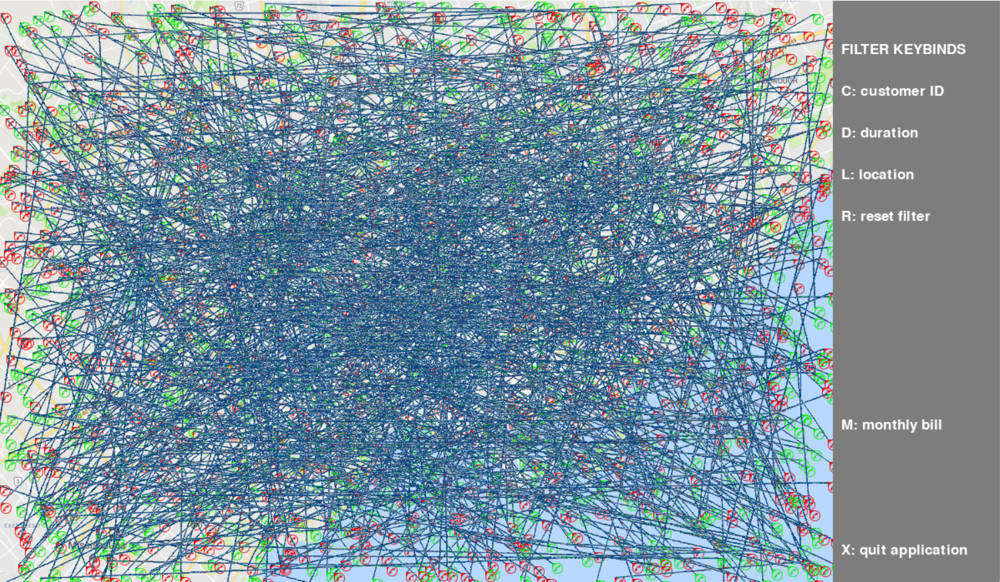

# Exceptional University Projects 🎓💻

This repository is a curated collection of **notable software projects, labs, and assignments** completed during my time at the **University of Toronto Mississauga**.  
It highlights my work across **Java, Python, RISC-V Assembly, object-oriented design, software architecture, data structures, algorithms, and interactive media**.

Rather than serving as a single application, this repo acts as a **portfolio of academic and technical growth**, showcasing both small foundational exercises and larger, system-level projects.

---

## 📂 Repository Overview

The repository is organized into several major projects and collections:

- **Boggle Game** — Full Java implementation of the Boggle word game  
- **Computer Science Labs & Assignments** — Java, Python, and RISC-V Assembly labs covering OOP, design patterns, algorithms, data structures, and computer architecture  
- **Shadow In The Dark** — Full-featured survival game written entirely in RISC-V assembly  
- **Inventory Server** — Distributed microservice-style backend system  
- **Map Plotting & Search** — Python-based data visualization and filtering system  
- **The Twine Interview** — Interactive narrative game exploring bias and decision-making  

Each section below links directly to its folder and explains its technical focus.

---

## 🎲 Boggle Game (Java)

📁 `Boggle Game/`

A complete **Java-based implementation of the Boggle word game**, including game logic, scoring, persistence, and testing.

### Key Features

- Object-oriented design with clear separation of concerns
- Dictionary-based word validation
- Persistent storage for saved games and scores
- Unit tests to verify correctness
- Modular architecture (game logic, grid, stats, storage)

### Technologies & Concepts

- Java
- OOP principles
- File I/O
- Unit testing
- Data persistence

### Screenshot


---

## 🧪 Computer Science Labs & Assignments

📁 `CS Labs/`

A comprehensive collection of labs across **three core computer science courses**, covering programming fundamentals, data structures, algorithms, and computer architecture.

---

### 📁 CSC148 - Python

Python labs covering core computer science concepts and data structures.

#### Topics Covered

- Object-Oriented Programming
- Abstract Data Types
- Recursion & Iteration
- Trees, BSTs, Linked Lists
- Sorting algorithms (TimSort)
- Testing & test-driven development

#### Notable Highlights

- **Tree & BST Implementation** (Lab08, Lab09)
- **Recursive List Structures** (Lab06, Lab07)
- **Performance Profiling** (Lab09)
- **TimSort Implementation** (Lab11)

---

### 📁 CSC207 - Java

Java labs emphasizing object-oriented design and software design patterns.

#### Topics Covered

- Object-Oriented Programming (Java)
- Design Patterns:
  - Adapter Pattern
  - Decorator Pattern
  - Observer Pattern
  - Visitor Pattern
- Testing & test-driven development
- Event-driven programming

#### Notable Highlights

- **AST Expression Evaluator** (Lab07) — Visitor pattern implementation
- **Tree Visualization & Filtering** (Lab05) — Event handling and data visualization
- **Braille Translator** (Lab04) — Character encoding and translation
- **Design Pattern Implementations** (Lab06, Lab08, Lab09, Lab10)

---

### 📁 CSC258 - Assembly (RISC-V)

RISC-V assembly projects demonstrating low-level programming, processor behavior, memory systems, pipelining, and performance optimization.

All programs were written and tested using [**CPU-Lator**](https://cpulator.01xz.net/?sys=rv32-spim) and [**Ripes**](https://ripes.me/).

#### Labs Covered

- **Lab 1** — Basic I/O and Arithmetic
- **Lab 2** — Branching and Loops
- **Lab 3** — Arrays and Functions
- **Lab 4** — Recursion and Stack Management
- **Lab 5** — Datapath and Control Signals
- **Lab 6** — Pipelining and Hazards
- **Lab 7** — Cache Performance and Optimization

#### Key Concepts

- RISC-V instruction set architecture
- Function calls and stack frames
- Recursive algorithms in assembly
- 5-stage pipelined processor (IF, ID, EX, MEM, WB)
- Data hazards and forwarding
- Cache locality and memory optimization
- Syscall interface and I/O operations

---

## 🎮 Shadow In The Dark (RISC-V Assembly Game)

📁 `Project - Shadow In The Dark/`

A **full-featured survival horror game** written entirely in RISC-V assembly (~1000 lines). This project showcases advanced assembly programming techniques and demonstrates mastery of low-level system design.

### 📋 Overview

*Shadow In The Dark* is a turn-based horror game where players navigate a dark maze, collect a match, and light a candle before their fear gauge reaches 100. A shadow monster stalks the player, increasing fear when nearby and moving intelligently toward the player each turn.

**Files:**

- **Shadow In The Dark.s** — Complete game implementation
- **Shadow In The Dark – User Guide.pdf** — Gameplay documentation

---

### 🔧 Technical Architecture

#### **Core Game Engine**

- **Procedural Map Generation**  
  Uses a custom Linear Congruential Generator (LCG) with parameters from Park & Miller's research to generate unique, random game boards each session.

- **Dynamic Board Rendering**  
  ASCII-based grid system with real-time character updates:
  - `@` Player | `M` Match | `C` Candle | `*` Lit Candle | `S` Shadow | `#` Wall | `.` Floor

- **Collision Detection & Validation**  
  Boundary checking prevents wall traversal and ensures all game objects spawn in valid, non-overlapping positions.

---

#### **AI Pathfinding System**

The shadow monster implements a **Manhattan distance pathfinding algorithm**:

- Calculates shortest path to player position each turn
- Moves one tile closer per turn (prioritizes X-axis, then Y-axis)
- Respawns at random locations when adjacent to player (with distance constraints)

**Proximity Detection:**  
Uses Chebyshev distance (8-directional adjacency) to detect when the shadow is within one tile (including diagonals), triggering fear increases and respawns.

---

#### **Advanced Memory Management**

1. **Unlimited Undo Stack**  
   - Dedicated 4KB buffer (512 states × 8 bytes) in `.data` section
   - Stack-based state machine stores: player position, shadow position, fear level, match status, candle status
   - Push/pop operations with overflow protection
   - Fully reversible gameplay with zero state loss

2. **Dynamic Heap Allocation**  
   - Runtime memory allocation via `sbrk` syscall for multiplayer mode
   - Two parallel arrays maintain player scores and IDs
   - Scales to support unlimited players (memory-limited only)

---

#### **Multiplayer Competitive Mode**

**Turn-Based System:**

- Each player plays the **identical map** with same object positions
- Fair competition ensured through `reset_to_initial_map` function
- Saved initial positions restore map state between players

**Scoring & Leaderboard:**

- Fear gauge serves as score metric (lower is better)
- Bubble sort algorithm ranks players by final fear level
- Parallel array sorting preserves original player IDs
- Tie detection identifies and displays all tied winners

---

### 🧠 Key Technical Implementations

#### **1. State Management**

```
Game State Structure (8 bytes):
├─ Character Position (2 bytes: x, y)
├─ Shadow Position (2 bytes: x, y)
├─ Fear Factor (1 byte)
├─ Match Status (1 byte)
├─ Candle Status (1 byte)
└─ Padding (1 byte)
```

#### **2. Random Number Generation**

- Implements Park-Miller LCG: `X(n+1) = (1664525 × X(n) + 1013904223) mod 2³²`
- Seeded with system time for session uniqueness
- Used for object placement and shadow respawn locations

#### **3. Function Call Hierarchy**

- **13 modular subroutines** with proper stack frame management
- Caller/callee register conventions (`s0-s5` preserved, `t0-t6` temporary)
- Nested function calls up to 4 levels deep

#### **4. Memory Alignment**

- Word-aligned data structures (`.align 2`) for optimal memory access
- Proper byte vs. word storage for different data types
- Stack pointer management maintains 4-byte alignment

---

### 🎯 Low-Level Features

- **Syscall Interface:** File I/O (`read`, `write`), memory allocation (`sbrk`), time (`gettimeofday`)
- **Bitwise Operations:** Absolute value calculations, distance metrics
- **Conditional Branching:** Complex game logic with minimal branch misprediction
- **Register Optimization:** Strategic use of 32 RISC-V registers to minimize memory access
- **Label Management:** 50+ labels for structured control flow

---

### 🏆 Demonstrable Skills

This project showcases:

✅ **Algorithm Implementation** — Pathfinding, sorting, random generation  
✅ **Data Structure Design** — Stacks, arrays, state machines  
✅ **Memory Management** — Static allocation, heap management, stack frames  
✅ **System Programming** — Direct syscall usage, I/O handling  
✅ **Code Organization** — Modular design with 1000+ lines of maintainable assembly  
✅ **Problem Solving** — Complex game logic translated to low-level instructions  
✅ **Performance Optimization** — Efficient algorithms with minimal overhead  

---

### 🎮 Gameplay Features

- **Controls:** `w/a/s/d` for movement, `u` for undo, `r` for restart, `q` for quit
- **Win Condition:** Light the candle before fear reaches 100
- **Lose Condition:** Shadow monster drives fear to maximum
- **Unlimited Players:** Supports any number of players for competitive scoring
- **Unlimited Undo:** Complete move history with full state restoration

---

## 🧾 Inventory Server (Distributed Systems Project)

📁 `Inventory Server/`

A large-scale **inventory management backend system** built with multiple services communicating together.

### Architecture

- Order Service
- Product Service
- User Service
- Load Balancer
- Java-based services with Python utilities

### Features

- REST-style service handlers
- Load testing tools
- Workload parsing
- Configuration-driven execution
- Extensive documentation (JavaDocs + PDF writeup)

### Technologies & Concepts

- Java
- Python
- Microservice-style architecture
- Load testing
- System design
- Client-server communication

### Architecture Diagram


---

## 🗺️ Map Plotting & Search (Python)

📁 `Map-Plotting-Search/`

A Python application that models **phone calls, billing, and customer data**, with visualization and filtering functionality.

### Features

- Data-driven application design
- Call history tracking
- Map-based visualization
- Modular domain models
- Automated tests

### Technologies

- Python
- Object-oriented design
- Data visualization
- JSON datasets

### Screenshot



---

## 🎭 The Twine Interview (Interactive Narrative)

📁 `The-Twine-Interview/`

An **interactive narrative game** built with Twine and HTML that explores **bias, decision-making, and systemic inequality** through branching dialogue and outcomes.

### Highlights

- Multiple characters and story paths
- Dynamic outcomes based on player choices
- Integrated images and audio
- Social commentary through game design

### Technologies

- Twine
- HTML
- Audio & visual storytelling

### Screenshots


---

## 🛠️ Skills Demonstrated Across This Repository

- **Languages:** Java, Python, RISC-V Assembly
- **Paradigms:** Object-Oriented Design, Procedural Programming, Low-Level Programming
- **Design Patterns:** Observer, Decorator, Adapter, Visitor
- **Data Structures:** Trees, BSTs, Linked Lists, Stacks, Arrays
- **Algorithms:** Sorting, Pathfinding, Recursion, Cache Optimization
- **Computer Architecture:** Pipelining, Memory Management, Cache Performance
- **Software Engineering:** Testing, Debugging, Documentation, Version Control
- **System Design:** Microservices, Distributed Systems, Load Balancing
- **Interactive Media:** Game Design, Narrative Development

---

## 📚 Reference Materials

📁 `CS Documentation/`

Contains reference materials used throughout coursework:

- **JAVA OOP 101.txt** — Java object-oriented programming reference
- **Assembly References/**
  - **Textbook.pdf** — *Computer Organization and Design: RISC-V Edition (Second Edition)*
  - **opcodes.pdf** — RISC-V instruction set reference and opcode formats

---

## 📌 Notes

- Each project folder contains its **own README** with implementation-specific details.
- This repository is intended for **academic, learning, and portfolio** purposes.
- Code reflects iterative learning and increasing complexity over time.

---

## 📫 Contact

If you'd like to discuss any of these projects, feel free to reach out via GitHub or LinkedIn.
