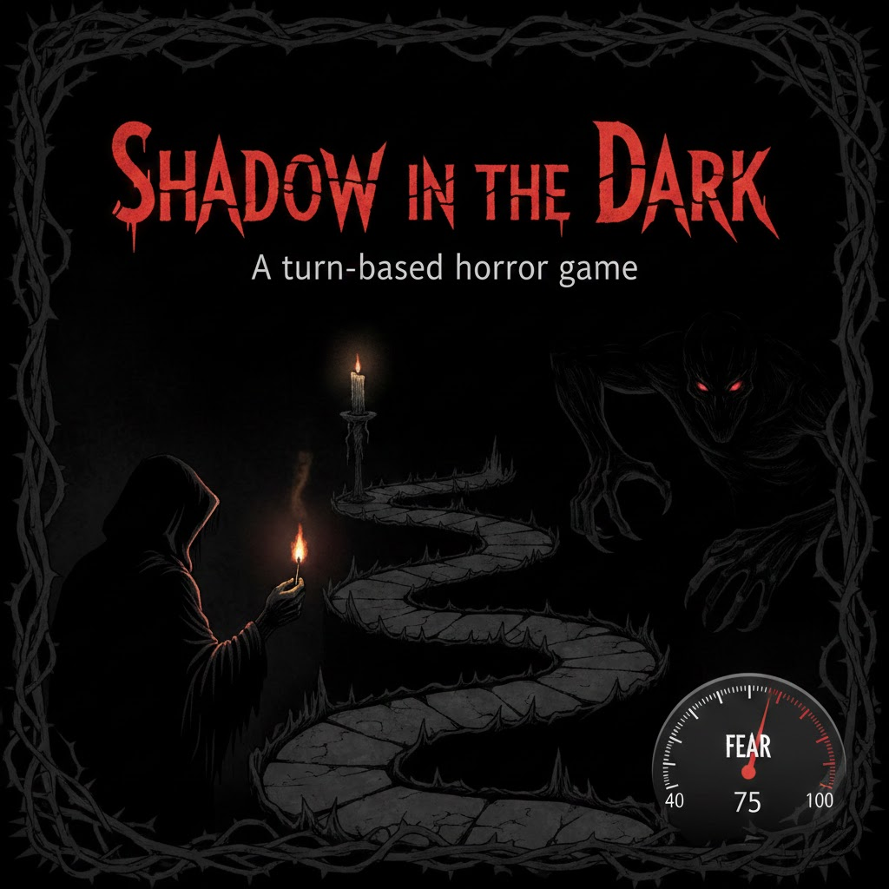

# 🎮 Shadow In The Dark (RISC-V Assembly Game)



A **full-featured survival horror game** written entirely in RISC-V assembly (~1000 lines). This project showcases advanced assembly programming techniques and demonstrates mastery of low-level system design.

## 📋 Overview

*Shadow In The Dark* is a turn-based horror game where players navigate a dark maze, collect a match, and light a candle before their fear gauge reaches 100. A shadow monster stalks the player, increasing fear when nearby and moving intelligently toward the player each turn.

**Files:**

- **Shadow In The Dark.s** — Complete game implementation
- **Shadow In The Dark – User Guide.pdf** — Gameplay documentation

---

## 🔧 Technical Architecture

### **Core Game Engine**

- **Procedural Map Generation**  
  Uses a custom Linear Congruential Generator (LCG) with parameters from Park & Miller's research to generate unique, random game boards each session.

- **Dynamic Board Rendering**  
  ASCII-based grid system with real-time character updates:
  - `@` Player | `M` Match | `C` Candle | `*` Lit Candle | `S` Shadow | `#` Wall | `.` Floor

- **Collision Detection & Validation**  
  Boundary checking prevents wall traversal and ensures all game objects spawn in valid, non-overlapping positions.

---

### **AI Pathfinding System**

The shadow monster implements a **Manhattan distance pathfinding algorithm**:

- Calculates shortest path to player position each turn
- Moves one tile closer per turn (prioritizes X-axis, then Y-axis)
- Respawns at random locations when adjacent to player (with distance constraints)

**Proximity Detection:**  
Uses Chebyshev distance (8-directional adjacency) to detect when the shadow is within one tile (including diagonals), triggering fear increases and respawns.

---

### **Advanced Memory Management**

1. **Unlimited Undo Stack**  
   - Dedicated 4KB buffer (512 states × 8 bytes) in `.data` section
   - Stack-based state machine stores: player position, shadow position, fear level, match status, candle status
   - Push/pop operations with overflow protection
   - Fully reversible gameplay with zero state loss

2. **Dynamic Heap Allocation**  
   - Runtime memory allocation via `sbrk` syscall for multiplayer mode
   - Two parallel arrays maintain player scores and IDs
   - Scales to support unlimited players (memory-limited only)

---

### **Multiplayer Competitive Mode**

**Turn-Based System:**

- Each player plays the **identical map** with same object positions
- Fair competition ensured through `reset_to_initial_map` function
- Saved initial positions restore map state between players

**Scoring & Leaderboard:**

- Fear gauge serves as score metric (lower is better)
- Bubble sort algorithm ranks players by final fear level
- Parallel array sorting preserves original player IDs
- Tie detection identifies and displays all tied winners

---

## 🧠 Key Technical Implementations

### **1. State Management**

```
Game State Structure (8 bytes):
├─ Character Position (2 bytes: x, y)
├─ Shadow Position (2 bytes: x, y)
├─ Fear Factor (1 byte)
├─ Match Status (1 byte)
├─ Candle Status (1 byte)
└─ Padding (1 byte)
```

### **2. Random Number Generation**

- Implements Park-Miller LCG: `X(n+1) = (1664525 × X(n) + 1013904223) mod 2³²`
- Seeded with system time for session uniqueness
- Used for object placement and shadow respawn locations

### **3. Function Call Hierarchy**

- **13 modular subroutines** with proper stack frame management
- Caller/callee register conventions (`s0-s5` preserved, `t0-t6` temporary)
- Nested function calls up to 4 levels deep

### **4. Memory Alignment**

- Word-aligned data structures (`.align 2`) for optimal memory access
- Proper byte vs. word storage for different data types
- Stack pointer management maintains 4-byte alignment

---

## 🎯 Low-Level Features

- **Syscall Interface:** File I/O (`read`, `write`), memory allocation (`sbrk`), time (`gettimeofday`)
- **Bitwise Operations:** Absolute value calculations, distance metrics
- **Conditional Branching:** Complex game logic with minimal branch misprediction
- **Register Optimization:** Strategic use of 32 RISC-V registers to minimize memory access
- **Label Management:** 50+ labels for structured control flow

---

## 🏆 Demonstrable Skills

This project showcases:

✅ **Algorithm Implementation** — Pathfinding, sorting, random generation  
✅ **Data Structure Design** — Stacks, arrays, state machines  
✅ **Memory Management** — Static allocation, heap management, stack frames  
✅ **System Programming** — Direct syscall usage, I/O handling  
✅ **Code Organization** — Modular design with 1000+ lines of maintainable assembly  
✅ **Problem Solving** — Complex game logic translated to low-level instructions  
✅ **Performance Optimization** — Efficient algorithms with minimal overhead  

---

## 🎮 Gameplay Features

- **Controls:** `w/a/s/d` for movement, `u` for undo, `r` for restart, `q` for quit
- **Win Condition:** Light the candle before fear reaches 100
- **Lose Condition:** Shadow monster drives fear to maximum
- **Unlimited Players:** Supports any number of players for competitive scoring
- **Unlimited Undo:** Complete move history with full state restoration
